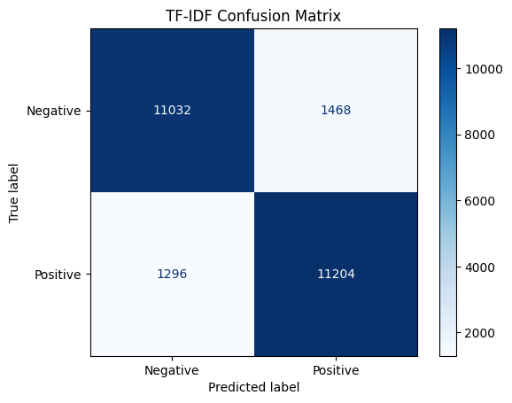
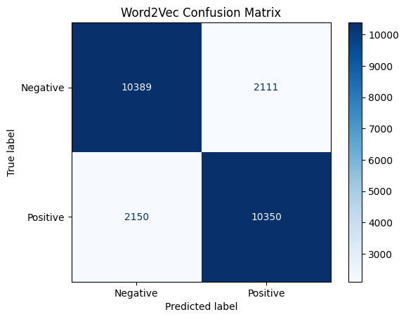
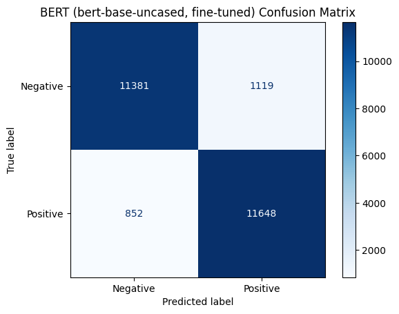

# IMDB Sentiment Analysis: TF-IDF vs Word2Vec vs BERT

A fair, side-by-side comparison of three text-representation approaches for
binary sentiment classification on the 50,000-review IMDB movie review
dataset:

1. **TF-IDF** features + Logistic Regression
2. **Word2Vec** (averaged word embeddings) + Logistic Regression
3. **BERT** (`bert-base-uncased`, fine-tuned)

All three models are trained on the same 20,000-review split and evaluated
on the exact same 25,000-review held-out test set, so no model gets an
easier or smaller test set than another. A fixed random seed (`SEED = 42`)
is used throughout for reproducibility.

## Project Structure

```
sentiment-analysis-imdb/
│
├── notebooks/
│   └── sentiment_analysis_imdb.ipynb   # full analysis, training, and evaluation
├── images/                             # confusion matrix screenshots (see below)
├── README.md
├── requirements.txt
└── .gitignore
```

## Dataset

- **Source:** [`stanfordnlp/imdb`](https://huggingface.co/datasets/stanfordnlp/imdb) via 🤗 Datasets — 50,000 movie reviews labeled Positive/Negative.
- **Split:** 20,000 train / 5,000 validation (stratified split of the official 25,000-review train set) / 25,000 test (official held-out test set, untouched until final scoring).
- **No data leakage:** the TF-IDF vectorizer, the Word2Vec model, and BERT's fine-tuning are all fit only on the training split. The test set is only ever scored once, at the end, by each already-trained model.

## Methodology

- **Preprocessing:** two cleaning paths — a heavier one for TF-IDF/Word2Vec (lowercased, HTML stripped, punctuation removed, digits kept since patterns like "10/10" carry sentiment signal) and a minimal one for BERT (HTML stripped only, case/punctuation/stopwords preserved so the tokenizer sees natural text).
- **TF-IDF:** `max_features=10000`, unigrams + bigrams, fed into a Logistic Regression classifier.
- **Word2Vec:** 100-dim vectors trained from scratch on the training set, averaged per review, fed into a Logistic Regression classifier. Trained single-threaded for deterministic results.
- **BERT:** `bert-base-uncased` fine-tuned for 2 epochs (max sequence length 256, dynamic per-batch padding), with a documented DistilBERT fallback path for constrained environments.
- **Metrics:** Accuracy, Precision, Recall, and F1 computed via scikit-learn for every model, alongside training time and sample counts.

## Results

| Model | Train Samples | Test Samples | Accuracy | Precision | Recall | F1-score | Training Time |
|---|---|---|---|---|---|---|---|
| TF-IDF + Logistic Regression | 20,000 | 25,000 | 88.94% | 88.42% | 89.63% | 0.8902 | ~31.3s |
| Word2Vec + Logistic Regression | 20,000 | 25,000 | 82.96% | 83.06% | 82.80% | 0.8293 | ~66.6s |
| BERT (bert-base-uncased, fine-tuned) | 20,000 | 25,000 | **92.12%** | **91.24%** | **93.18%** | **0.9220** | ~525.5s (~8.8 min) |

**BERT** was the strongest model on every metric, beating TF-IDF by ~3.2
accuracy points and Word2Vec by ~9.2 points — at roughly 17x TF-IDF's
training time and a GPU requirement the other two models don't have.
**TF-IDF** was a surprisingly strong, fast baseline, showing that
sentiment-heavy words carry a lot of signal on their own. **Word2Vec**
underperformed both — averaging word vectors across a whole review discards
word order and dilutes strong sentiment words with neutral ones.

### Confusion Matrices

**TF-IDF + Logistic Regression**



**Word2Vec + Logistic Regression**



**BERT (fine-tuned)**



## Error Analysis

- Several reviews are misclassified by **all three models** in the same
  way — these tend to be genuinely ambiguous or borderline-labeled examples
  rather than a weakness specific to one representation.
- **False positives** often come from genre-fan reviews written in hedged,
  lukewarm language, where the overall verdict is mildly negative but
  individual clauses read as positive.
- **False negatives** frequently come from reviews that praise a film's
  theme while spending most of the text criticizing specific weaknesses —
  mixed-sentiment cases that are hard for models relying on aggregate word
  signal.
- Word2Vec makes clearly more errors (4,261 total) than TF-IDF (2,764) or
  BERT (1,971), and shares nearly all of TF-IDF's false positives.

## Setup (VS Code)

1. Clone the repo and open it in VS Code.
2. Create and activate a virtual environment:
   ```bash
   python -m venv venv
   source venv/bin/activate   # Windows: venv\Scripts\activate
   ```
3. Install dependencies:
   ```bash
   pip install -r requirements.txt
   ```
4. Open `notebooks/sentiment_analysis_imdb.ipynb` in VS Code and select the
   `venv` interpreter as the notebook kernel.
5. Run all cells. A GPU is strongly recommended for the BERT fine-tuning
   step — on CPU-only machines, switch `BERT_MODEL_NAME` to
   `"distilbert-base-uncased"` inside the notebook for a faster, documented
   fallback.

## Conclusion

Fine-tuned BERT delivered the best results across every metric, confirming
that contextual attention over the full review helps sentiment
classification — at a real cost in training time and GPU memory. TF-IDF
remains a strong, cheap baseline when compute is limited. Averaged
Word2Vec embeddings were the weakest of the three, since collapsing a
review into a single averaged vector discards word order and ordering
information that the other two approaches preserve.
